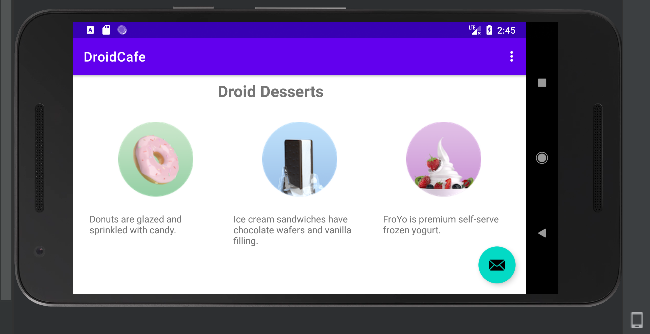

## DroidCafe Homework - Solution Code

App that demonstrates images used as buttons and a floating action button to use an intent to launch a second activity.

## Pre-requisites
To run this app you should be familiar with creating and running apps in Android Studio.

## Getting Started

1. Download the code.
2. Open the code in Android Studio.
3. Run the app.

## Result

#### DroidCafe Homework Screenshots

