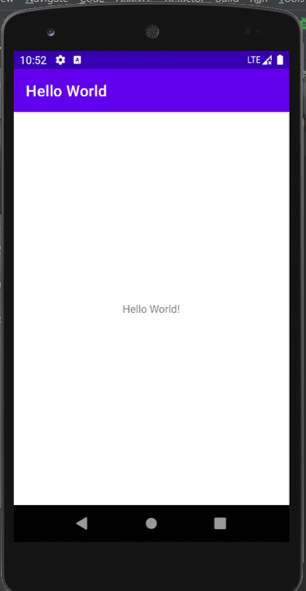
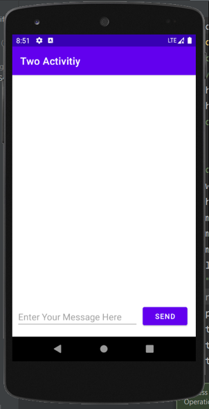
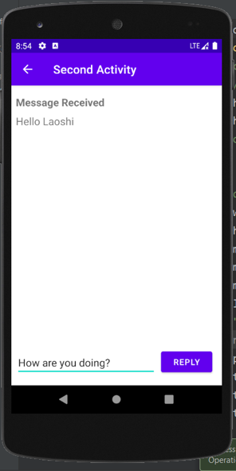
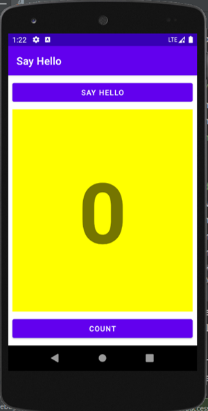
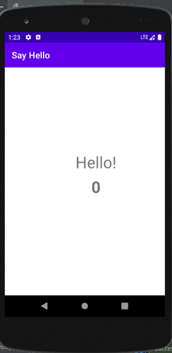
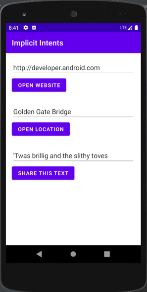
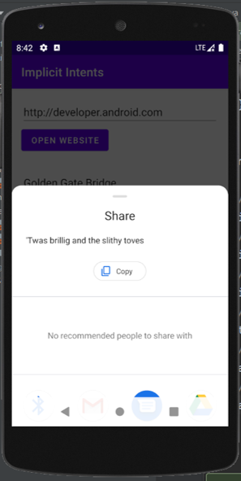
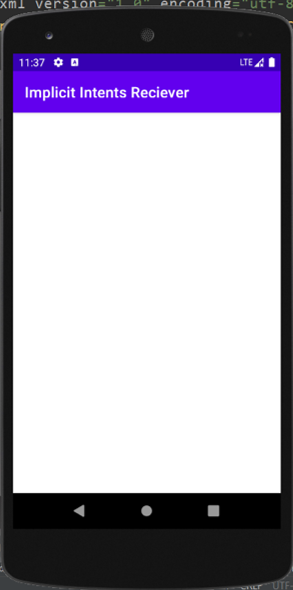
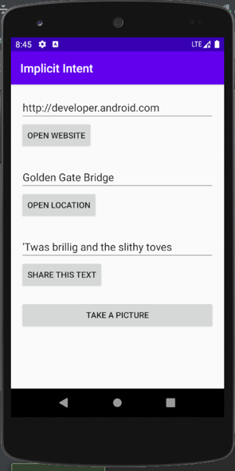
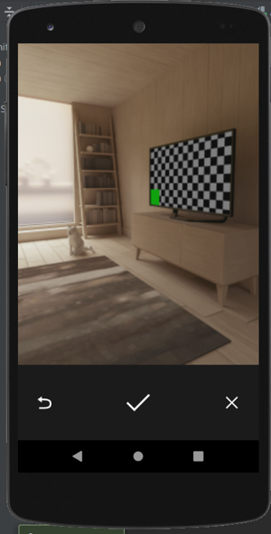

 # Mobile-Application-Repo
1. To Develop a Mobile Intelligent Running Application
2. (Intelligent weather focasting app)

# Features
1. The app can read weather accurately
2. Can record real time data
3. Can store user data for seven days

# Requirements
1. Android Studio 11
2. Java 8/10/11/12
3. Kotlin (Will be Optional)
4. Xml

# Classwork and Assignments

## Week 1.Kick Off
### Classwork:
<li>To create a GitHub of my project: Github is a code hosting platform for version control and collaboration.
<li>To write a README.md: Markdown is a lightweight markup language that you can use to add formatting elements to plaintext text documents.

## Week 2. Get started

### Codelab 1.1: Android Studio and Hello World.

<li> Click this link to view Hello World Classwork: https://github.com/domobao1984/Mobile-Application-Repo/tree/Helloworld_Classwork

<li> Click this link to view Hello World Homework: https://github.com/domobao1984/Mobile-Application-Repo/tree/HelloWorld_Homework

## Week 3. Layouts and resources for the UI

### Codelab 1.2 Part A: Your first interactive UI

<li> Click this link to view HelloToast Classwork: https://github.com/domobao1984/Mobile-Application-Repo/tree/HelloToast

### Codelab 1.2 Part B: The layout editor

<li> Click this link to view HelloConstraint_Homework: https://github.com/domobao1984/Mobile-Application-Repo/tree/HelloConstraint

## Week 4. Activities and intents

### Codelab 2.1: Activities and intents

<li>  Click this link to view TwoActivities Classwork: https://github.com/domobao1984/Mobile-Application-Repo/tree/TwoActivity_Classwork

<li> Click this link to view TwoActivities Homework: https://github.com/domobao1984/Mobile-Application-Repo/tree/TwoActivities_HomeWork

## Week 5. Implicit Intents

### Codelab 2.3: Implicit Intents

<li> Click this link to view ImplicitIntents Classwork: https://github.com/domobao1984/Mobile-Application-Repo/tree/Implicit_Classwork

<li> Click this link to view Implicit_IntentsReciver Classwork: https://github.com/domobao1984/Mobile-Application-Repo/tree/ImplicitIntent_Receiver
 

<li> Click this link to view ImplicitIntents Homework: https://github.com/domobao1984/Mobile-Application-Repo/tree/ImplicitIntent_Homework

